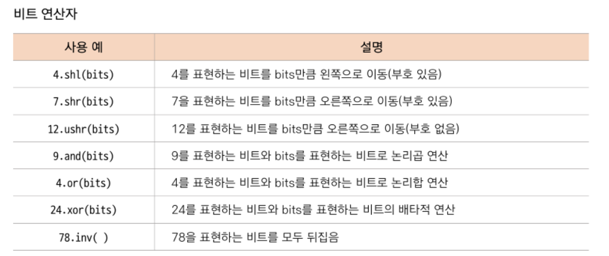
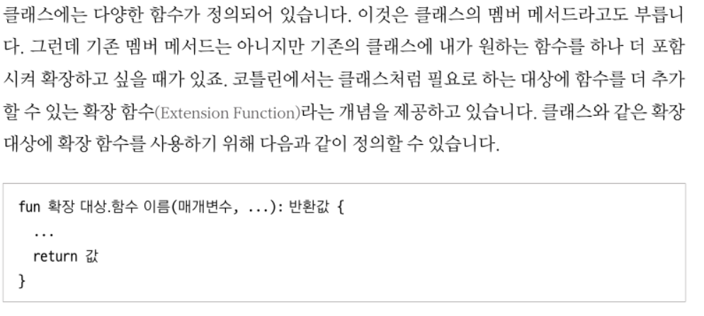
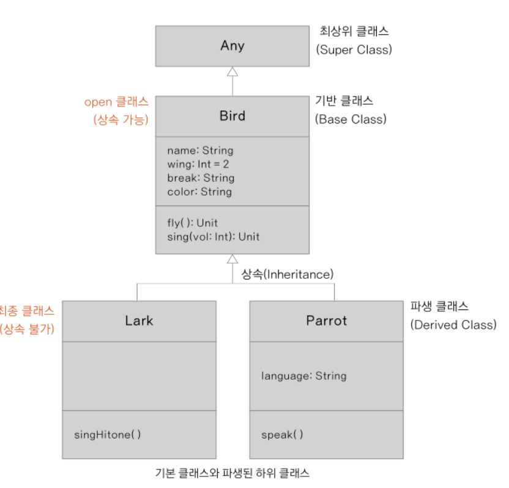
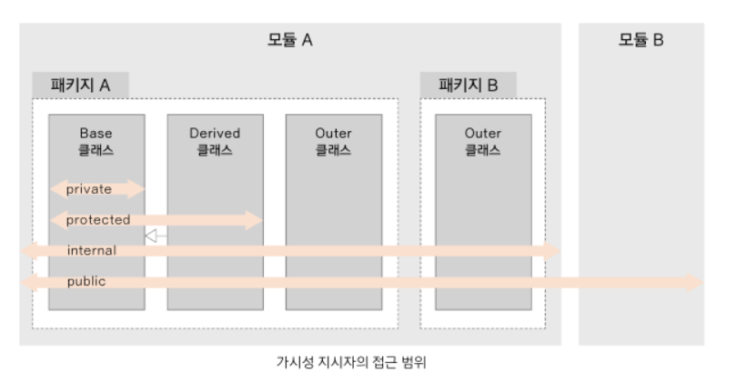
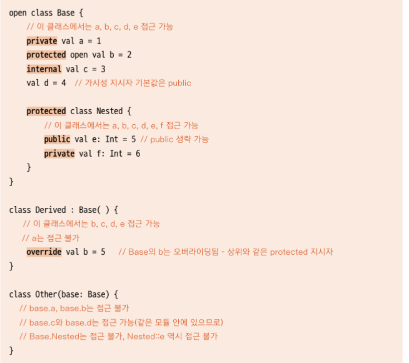

# Doit_Kotlin

# 2. 변수와 자료형 연산자
* val - 변경 불가능
* var - 변경 가능

~~~kotlin
val username : String = "Kildong"
~~~

* 타입 추론이 가능 
~~~kotlin
val username = "Kildong"
~~~

* 코틀린 자료형은 참조형 자료형을 사용

* 표현식은 {$} (중괄호) 로 , 변수는 $로

* 다중 문자열 처리
~~~kotlin
    // 다중 문자열 처리
    val formattedString = """
       var a = 6
       var b = "Kotlin"
       println(a + num)
    """
~~~

* typealias 로 별명 붙이기
~~~kotlin
typealias Username = String

fun main() {
    //username 이 string
    var user:Username = "Kildong"
}
~~~

### 2-3. 자료형 검사하고 반환하기

* null 허용하도록할려면 자료형에 ? 붙이기

~~~kotlin
    var str1 : String = "Hello Kotlin"
    // 널자체를 허용하지 않음
    str1 = null  //error!!

    var str2 : String? = "Hello Kotlin"
    // ? 붙음으로 null 허용
    str2 = null

    println(str2)  // null print된다.
~~~

* 세이프 콜과 non-null 단정 기호
~~~kotlin
    var str1: String? = "Hello"
    str1 = null

    //error!!
    //    println("str1 : $str1 , length: ${str1.length}")

    //safe call -> null이 아니면 length / null이면 null 반환
    //    println("str1 : $str1 , length: ${str1?.length}")

    //non=null 단정기호 -> null 검사 없이 진행 -> NPE발생
    println("str1 : $str1 , length: ${str1!!.length}")

    //조건문 사용
    var len = if(str1 != null) str1.length else -1
    println("str1 : $str1 , length: $len")
~~~

* 엘비스 연산자 : 변수가 null인지 검사하여 null이 아니면 왼쪽 / null이면 오른쪽 식을 실행

~~~ kotlin
    var str1: String? = "fdsfa"
    str1 = null
    println("str1 : $str1 length: ${str1?.length ?: -1}")
    
        //같은 식
//    if (str1 != null) str1.length else -1
~~~

* 자료형 변환 : 기본형과 참조형 자료형 비교 원리 이해하기
~~~ kotlin
    val a: Int = 128
    val b = a
    println(a === b)

    val c: Int? = a
    val d: Int? = a
    val e: Int? = c

    println(c == d) //값은 동일
    println(c === d) // 값은 동일하나 참조하는 곳이 다르다
    println(c === e) // 참조하는 곳과 값이 같다.

    //형 변환 test
    val test : Double = a.toDouble()
    println(test)
~~~

* 스마트 캐스트 : 컴파일러가 자동 형변환 
* 자료형 검사 : is 사용
* Any 자료형 : 최상위 기본 클래스

~~~kotlin
    var test: Number = 12.2

    println("$test")

    test = 12
    println("$test")

    test = 120L
    println("$test")

    test += 12.0f
    println("$test")

    // 자료형 검사
    println(test is Int)
    println(test !is Int)

    // Any 자료형 -> 최상위 기본 클래스, 자료형을 결정하지 않아도 선언 가능
    val x :Any
    x = "Hello"
    if (x is String){
        print(x.length)
    }
~~~

* Any형 변수의 변환

~~~ kotlin
    var a: Any = 1
    a = 20L
    println("a: $a type: ${a.javaClass}") // a 의 자바 기본형을 출력하면 long이 나옴
~~~

~~~ kotlin
    fun main() {
        checkArg("Hello") //String
        checkArg(5)       //Int
    }

    fun checkArg(x: Any) {
        println("${x.javaClass} type!!")
    }
~~~

### 2-4. 코틀린 연산자

* 기본적인 연산자는 JAVA와 비슷하다.

1. 산술 연산자
   
2. 대입 연산자
   
3. 증가 감소 연산자
~~~ kotlin
    var num1 = 10
    var num2 = 10

    // 연산자 수행 이전에
    val result1 = ++num1
    //연산자 수행 이후에
    val result2 = num2++

    println("result1 : $result1") //11
    println("result2 : $result2") //10
~~~

4. 비교 연산자
   
   === !== // 참조연산자 (주소까지 같은지 판별)

5. 논리 연산자
   
6. 비트 연산자

6-1. 비트 메서드

* 부호 비트는 이동시키지 않으면서 사라진 비트의 값을 0으로 채운다.

~~~kotlin
fun main() {
    var x = 4
    var y = 0b0000_1010 //10진수 5
    var z = 0x0F //10진수 15

    println("x shl 2 -> ${x shl 2}") // 16
    println("x.inv() -> ${x.inv()}") // -5

    println("y shr 2 -> ${y shr 2}") // 2

}
~~~

6-2. 비트 이동 연산자 ushr
* 잘 이해가 안감..
* 제일 왼쪽 비트에 0을 밀어 넣으면서 오른쪽으로 비트가 이동한다.(부호 비트 포함)

~~~kotlin
fun main() {
    val number1 = 5
    val number2 = -5

    println(number1 shr 1) //2 (0101) -> (0010)
    println(number1 ushr 1) // 왜 2??
    println(number2 shr 1) // 1111 1111 1111 ..... 1111 0101 -> 맨뒤가 0110
    println(number2 ushr 1) //책 참고
}
~~~

6-3. 논리 연산자 or 

6-4. 논리곱 연산자 and

6-5. 배타적합 연산자 xor 

* 베타적합을 이용하여 swap 가능

~~~kotlin
fun main() {
    var number1 = 12
    var number2 = 25

    number1 = number1 xor number2
    number2 = number1 xor number2
    number1 = number1 xor number2

    println("number1 - $number1") //25
    println("number1 - $number2") //12

}
~~~

6-6. 반전연산자 inv

* 비트를 뒤집는다.

# 3. 함수와 함수형 프로그래밍
### 3-1.함수 선언/호출

* 함수 구조

1. 함수 선언할때 -> 매개변수
2. 함수 호출할때 -> 인자
~~~ kotlin
//기본
fun sum(a:Int, b:Int): Int {
    var sum = a + b
    return sum
}

//return 변수 생략
fun sum(a:Int, b:Int): Int {
    return a + b
}

//중괄호 생략
fun sum(a:Int, b:Int): Int = a + b

//변환값 type 생략
fun sum(a:Int, b:Int) = a + b
~~~

* 함수의 호출과 메모리

책 참고. stack에 대한 학습 필요(선입후출)

main() 생성 -> max()생성 -> max()소멸 -> main()소멸

* 반환값이 없는 함수

1. 두 인자를 그대로 출력하는 함수 (반환값이 없을때는 Unit사용) 
   -> java void 와 비슷하나 unit의 경우는 특수한 객체를 반환한다는 차이점이 있다.

~~~kotlin
fun printSum(a: Int, b: Int): Unit {
    println("sum of $a and $b is ${a+b}")
}
~~~

* 매개변수 제대로 활용하기
1. 코틀린은 매개변수의 기본값 기능 제공

~~~kotlin
fun main() {
    val name = "길동씨"
    val email = "kildong@example.kr"

    add(name) //default가 출력된다.
    add(name, email)
    add("하하하하","hohohoho.co.kr")
    defaultArgs() //300
    defaultArgs(200) //400
}

fun add(name:String, email:String = "default") {
    val output = "${name}님의 이메일은${email}입니다"
    println(output)
}

fun defaultArgs(x: Int = 100, y:Int = 200){
    println(x+y)
}

~~~

* 매개변수 이름과 함께 함수 호출하기

~~~kotlin
fun main() {
    namedParam(x = 200, z = 100) // x,z의 이름과 함수를 같이 호출
    namedParam(z = 150) // z의 이름과 함께 호출
}

fun namedParam(x: Int = 200, y: Int=200, z:Int){
    println(x+y+z)
}
~~~

* 매개 변수의 개수가 고정되지 않는 함수 사용하기

인자가 3개,4개인 함수가있는데 동작만 동일하다면 함수를 여러개 만드는 행위는 낭비

#### 코틀린에서는 가변 인자를 사용!!

~~~kotlin
fun main() {
    normalVarargs(1,2,3,4) //1234
    normalVarargs(5,6,7) //567
}

// 가변인자 vararg
fun normalVarargs(vararg counts: Int) {
    for (num in counts) {
        print("$num ")
    }

    print("\n")
}
~~~

### 3-2. 함수형 프로그래밍
* 함수형 프로그래밍은 람다식/고차 함수를 사용

* 순수 함수
-> 부작용이 없는 함수가 함수 외부의 어떤 상태도 바꾸지 않는 경우

~~~kotlin
fun sum(a: Int, b:Int):Int {
    return a+b // 동일한 인자인 a,b를 입력받아 항상 a + b를 출력
}
~~~
* 순수 함수의 조건
1. 같은 인자에 대하여 항상 같은 값을 반환한다.
2. 함수 외부의 어떤 상태도 바꾸지 않는다.

* 람다식
1. 수학에서 람다
   -> 이름이 없는 함수로 2개이상의 입력은 1개의 출력으로 단순화
2. 함수형 프로그래밍의 람다
   -> 다른 함수의 인자로 넘기는 함수, 함수의 결괏값으로 반환하는 함수, 변수에 저장하는 함수

* 일급 객체 
함수형 프로그래밍 에서는 함수를 일급 객체로 생각한다. 

* 일급 객체의 특징
1. 일급 객체는 함수의 인자로 전달할 수 있다.
2. 일급 객체는 함수의 반환 값에 사용할 수 있다.
3. 일급 객체는 변수에 담을 수 있다.

* 고차 함수
고차 함수는 다른 함수를 인자로 사용하거나 함수를 결괏값으로 반환하는 함수를 말합니다.

~~~kotlin
fun main() {
    println(highFunc({x,y -> x * y},10,20))
}

fun highFunc(sum: (Int, Int) -> Int, a:Int, b:Int): Int = sum(a,b)
~~~
   
* 함수형 프로그래밍의 정의와 특징
1. 순수 함수를 사용해야 한다.
2. 람다식을 사용할 수 있다.
3. 고차 함수를 사용할 수 있다.

### 3-3. 고차 함수와 람다식

#### 일반 함수의 고차 함수의 형태

* 일반 함수를 인자나 반환값으로 사용하는 고차 함수

~~~kotlin
//인자로 함수 사용 
fun main() {
    val res1 = sum(3,2)
    val res2 = mul(sum(3,3), 3)

    println("res1: $res1, res2: $res2") //5 18
}

fun sum(a:Int, b:Int) = a+b
fun mul(a:Int, b:Int) = a*b
~~~

~~~kotlin
//반환값으로 함수 사용
fun main() {
    println("funcfunc : ${funcFunc()}") //4
}

private fun sum(a: Int, b: Int) = a+b 

fun funcFunc():Int {
    return sum(2,2)
}
~~~

#### 람다식을 사용하는 고차 함수 형태

~~~kotlin
fun main() {
    var result: Int
    val multi = {x:Int, y:Int -> x * y} //일반 변수에 람다식을 할당
    result = multi(10, 20) // 람다식이 할당된 변수는 함수처럼 사용이 가능하다.
    println(result) //200
    println(multi) //(kotlin.Int, kotlin.Int) -> kotlin.Int
}
~~~

~~~kotlin
  //생략되지 않은 전체 표현
    val multi1: (Int, Int) -> Int = {x:Int, y:Int -> x * y}
    //선언 자료형 생략
    val multi2 = {x:Int,y:Int -> x*y}
    //람다식 매개변수 자료형의 생략
    val multi3 :(Int,Int) -> Int ={x,y -> x*y}

    val greet:() -> Unit={println("Hello")}
    val square:(Int) -> Int ={x -> x*x}
    
    val nestedLamda: () -> () -> Unit = {{println("nested")}}
~~~

* 매개변수에 람다식 함수를 이용한 고차 함수
~~~kotlin
fun main() {
    var result : Int
    result = highOrder({x,y -> x+y}, 10,20)
    println(result)
}

fun highOrder(sum_2:(Int, Int) -> Int, a:Int, b:Int):Int {
    return sum_2(a,b)
}
~~~

* 인자와 반환값이 없는 람다식 함수

~~~kotlin
fun main() {
    //자료형 추론이 가능하므로 val out = {prinln("Hello World")} 같은 형태로 가능
    val out:() -> Unit = {println("Hihi")}

    out() // 함수처럼 사용이 가능
    val new = out // 다른 변수에 할당도 가능
    new()
}
~~~

#### 람다식과 고차 함수 호출하기 
* 자바나 코틀린은 함수를 호출할떄 인자의 값만 복사하는 '값의 의한 호출'(Call by Value) 가 일반적

* C/C++은 포인터사용. '참조에 의한 호출(Call by Reference)'

* 값에 의한 호출로 람다식 사용하기
~~~kotlin

fun main() {
    val result = callByValue(lambda())
    println(result)
}

fun callByValue(b: Boolean):Boolean {
    println("callByValue function")
    return b
}

val lambda: () -> Boolean = { //람다 표현식이 2줄
    println("lambda function")
    true // 마지막 표현식 문장의 결과가 반환
}

//lambda function
//callByValue function
//true
~~~

* 이름에 의한 함다식 호출
~~~kotlin
fun main() {
    val result = callByName(otherLambda)
    println(result)
}

fun callByName(b: () -> Boolean):Boolean {
    println("callByName function")
    return b()
}

val otherLambda: () -> Boolean = {
    println("otherLambda function")
    true
}

//callByName function
//otherLambda function
//true
~~~

* 다른 함수의 참조에 의한 일반 함수 호출급

지금까지 람다식을 매개변수로 선언해서 사용 // 일반 함수 또는 다른 함수의 인자에서 호출하는 고차함수에 대해서 생각

~~~kotlin
fun main() {
    //sum()함수는 람다식이 아니라 sum 형태로 호출 불가능
    //하지만 매개변수 선언부를 보면 인자의 수와 자료형의 수가 동일하다.
//    val res1 = funcParam(3,2, sum)
    //인자와 반환값이 있는 함수
    val res1 = funcParam(3,2, ::sum)
    println(res1) // 5

    //인자가 없느 함수
    hello(::text) // hi! hello world

    //일반 변수에 값처럼 할당
    val likeLambda = ::sum
    println(likeLambda(6,6)) // 12

}

private fun sum(a: Int, b:Int) = a + b

fun text(a:String, b:String) = "Hi! $a $b"

fun funcParam(a: Int, b:Int, c:(Int, Int) -> Int):Int {
    return c(a,b)
}

fun hello(body: (String, String) -> String):Unit {
    println(body("Hello", "World"))
}
~~~

* 표기법 정리
~~~kotlin
hello(::text) // 함수 참조 기호
hello({a, b -> text(a,b)}) // 람다식 표현(동일한 결과)
hello{a, b -> text(a,b)} // 소괄호 생략 (동일한 결과)
~~~

#### 람다식의 매개변수

1. 람다식에 매개변수가 없는 경우
   
2. 람다식의 매개변수가 1개인 경우 - $it 사용 가능
   
3. 람다식의 매개변수가 2개 이상인 경우 

~~~kotlin
fun main() {
    //매개변수 없는 람다식
    noParam { "Hello World" }                   // Hello World
    noParam ({"Hello World2"})                  // Hello World2

    oneParam ({a-> "Hello World2 $a"})          // OneParam
    oneParam { a-> "Hello World! $a" }          // 소괄호 생략 가능 / OneParam
    oneParam { "Hello World $it" }              // it 으로 대체 가능 (매개 변수가 한개 일 경우) / OneParam

    moreParam({a,b -> "HelloWordl! $a $b"})     //HelloWordl! test Test2
}

//매개변수가 없는 람다식이 noParam 함수의 매개변수 out 으로 지정됨
fun noParam(out: () -> String) = println(out())

// 매개변수가 1개 있는 람다식이 oneParam 함수의 매개변수 out 으로 지정됨
fun oneParam(out:(String) -> String) {
    println("OneParam")
}

//매개변수가 2개
fun moreParam(out: (String, String) -> String) {
    println(out("test", "Test2"))
}

~~~

4. 일반 함수에 람다식 매개변수 2개이상 사용 
~~~kotlin
fun main() {
    twoLambda({a,b -> "First $a $b"}, {"Second $it"})
    twoLambda({a,b -> "First $a $b"}) {"Second $it"}    //위와 동일 표현
}

fun twoLambda(first: (String, String) -> String, second: (String) -> String) {
    println(first("OneParam", "TwoParam"))
    println(second("OneParam"))
}

//First OneParam TwoParam
//Second OneParam
//First OneParam TwoParam
//Second OneParam
~~~

### 3-4. 고차 함수와 람다식의 사례 알아보기

#### 동기화를 위한 코드 구현 구경하기

책 참고 (동기화 / 네트워크 호출)

### 3-5. 코틀린의 다양한 함수 알아보기

1. 익명 함수 

-> 일반 함수이면서 이름이 없는 함수 
~~~kotlin
fun(x: Int, y: Int):Int = x + y

val add:(Int, Int) -> Int = fun(x,y) = x + y  // 변수 선언에 그대로 사용 가능

//선언 자료형을 람다식 형태로 써주면 변수 add는 람다식 함수처럼 add()로 사용 가능
val add = fun(x: Int, y:Int) = x + y
//람다식 표현법
val add = {x : Int, y:Int -> x + y}
~~~

2. 인라인 함수

-> 함수가 호출되는 곳에 함수 본문의 내용을 모두 복사해 넣어 함수의 분기 없이 처리됨.

* 런타임 오버헤드(?)를 줄일 수 있다
* 너무 남용하면 bytecode 양이 많아져, 최적화에 어려움
  -> noinline을 사용하여 줄인다.

~~~kotlin
fun main() {
    //코드상에서 shortFunc를 두번 호출하는것 처럼 보이나, 실제로 한번만 호출
    shortFunc(3) { println("First call: $it")}
    shortFunc(5) { println("Second call: $it")}
}

inline fun shortFunc(a: Int, out:(Int) -> Unit) {
    println("Before calling out()")
    out(a)
    println("After calling out()")
}
~~~

* 인라인 함수와 비지역 반환

1. 익명의 함수를 종료하기 위해 return 사용 가능 -> 인라인 함수에서도 동일하다

~~~kotlin
fun main() {
    shortFunc_third(3) {
        println("First call: $it")
        return //1
    }
}

//crossinline - 비지역 반환을 금지해야하는 람다식에 사용한다.
//inline fun shortFunc_third(a:Int, crossinline out:(Int) -> Unit) {
inline fun shortFunc_third(a:Int, out:(Int) -> Unit) {
    println("Before calling out()")
//    nestedFunc { out(a) }
    out(a)
    println("After calling out()") //2
}

fun nestedFunc(body: () -> Unit) {
    body()
}

//out(a) 는 inline되어 대체됨. -> 2는 실행이 안됨. 이러한 반환을 비지역 반환이라고 한다.
~~~

* 확장 함수
  
  
  
* String 클래스에 나만의 확장 함수 추가하기 
  
  -> 길이가 더 긴 문자열을 반환하는 확장 함수 getLongString()을 추가
  
  -> 기존 클래스의 선언부 수정하지 않고 외부에서 손쉽게 확장 가능.

   -> 동일한 이름이 있는 경우는 멤버 메서드가 우선적으로 호출된다.
  
~~~kotlin
fun main() {
    val source = "Hello World!"
    val target = "Kotlin"
    println(source.getLongString(target)) //Hello World
}

//String class에 getLongString 추가
fun String.getLongString(target:String):String =
    if (this.length > target.length) this else target
~~~

* 중위 함수

중위 표현법이란 클래스의 멤버를 호출할떄 사용하는 점(.)을 생략하고 함수 이름 뒤에 소괄호를 붙이지 않아 직관적인 이름을 사용할 수 있는 표현법

~~~kotlin

fun main() {
    //일반 표현법
    //val multi = 3.multiply(10)

    //중위 표현법

    val multi = 3 multiply 10
    println("multi: $multi") //multi: 30
}

infix fun Int.multiply(x:Int): Int {
    return this * x
}

~~~

* 꼬리 재귀 함수

-> 코틀린에서는 꼬리 재귀 함수(Tail Recursive Function) 을 통해 스택 오버플로 현상을 해결 가능

-> tailrec 사용

* factorial 재귀 함수

~~~kotlin
fun main() {
    val number = 4
    val result : Long

    result = factorial(number)
    println("Factorial: $number -> $result")
}

fun factorial(n: Int):Long {
    return if (n==1) n.toLong() else n * factorial(n-1)
}
~~~
* 일반적인 재귀함수는 너무 많은 분기를 할 경우 stack이 넘치는 위험이 있어서 꼬리 재귀를 사용해야한다.

* 꼬리 재귀로 스택 오버플로 방지하기
~~~kotlin
fun main() {
    val number = 5
    println("Factorial: $number -> ${factorial_two(number)}") // 5-> 120
}

tailrec fun factorial_two(n: Int, run:Int = 1): Long{
    return if (n==1) run.toLong() else factorial_two(n-1, run*n)
}
~~~

* 피보나치

~~~kotlin
fun main() {
    val n = 100
    val first = BigInteger("0")
    val second = BigInteger("1")

    println(fibonacci(n, first, second)) // 354224848179261915075
}

tailrec fun fibonacci(n: Int, a:BigInteger, b:BigInteger):BigInteger {
    return if (n == 0) a else fibonacci(n-1, b, a+b)
}
~~~

### 3-6. 함수와 변수의 범위
책 참고.. 

전역 변수 -> global 사용 

# 4. 프로그램의 흐름 제어

### 4-1. 조건문

* if - else 기본적인내용..

* 숫자 범위 표현에서 in 사용 하는 방법
~~~kotlin
fun main() {
    print("Enter the score: ")
    val score = readLine()!!.toDouble() //콘솔로부터 입력받는다 / !! not-null 사용
    var grade: Char = 'F'

//    if (score >= 90.0) {
//        grade = 'A'
//    } else if (score >= 80.0 && score <= 89.9) {
//        grade = 'B'
//    } else if (score >= 70.0 && score <= 79.9) {
//        grade = 'C'
//    }

    //변수 이름 in 시작값..마지막값으로 범위 표현 가능
    if (score >= 90.0) {
        grade = 'A'
    } else if (score in 80.0..89.9) {
        grade = 'B'
    } else if (score in 70.0..79.9) {
        grade = 'C'
    }

    println("Score : $score, Grade: $grade")
}
~~~

* when문으로 다양한 조건 처리하기
  -> 자바의 switch 랑 비슷하다.
  
~~~
when (인자) {
    인자에 일치하는 값 혹은 표현식 -> 수행할 문장
    인자에 일치하는 범위 -> 수행할 문장
    ...
    else -> 수행할 문장
}
~~~

* when 문 예시

~~~kotlin
fun main() {
    print("Enter the Score:")

    val score = readLine()!!.toDouble()
    var grade: Char = 'F'

    when(score) {
        in 90.0..100.0 -> grade = 'A'
        in 80.0..89.9 -> grade = 'B'
        in 70.0..79.9 -> grade = 'C'
        !in 70.0..100.0 -> grade = 'F'
    }

    println("Score: $score, Grade: $grade")
}
~~~

*인자가 없는 when 

~~~kotlin
fun main() {
    print("Enter the Score:")

    val score = readLine()!!.toDouble()
    var grade: Char = 'F'

    //인자가 없음
    when {
        score >= 90.0 -> grade = 'A'   //인자 있는 when 문과 다르게 조건식을 구성 가능
        score in 80.0..89.9 -> grade = 'B'
        score in 70.0..79.9 -> grade = 'C'
        score < 70.0 -> grade = 'F'
    }

    println("Score: $score, Grade: $grade")
}
~~~

* 다양한 자료형의 인자 받기
  * Any를 사용하여 다양한 자료형 인자를 받을 수 있다.
    
~~~kotlin
fun main() {
    cases("Hello")      //String
    cases(1)            //Int
    cases(System.currentTimeMillis())   // Long
    cases(temp())                       // Not a String
}

fun cases(obj: Any) {
    when (obj) {
        1 -> println("Int: $obj")
        "Hello" -> println("String: $obj")
        is Long -> println("Long: $obj")
        !is String -> println("Not a String")
        else -> println("Unknown")
    }
}

public class temp(){

}
~~~

### 4-2. 반복문

* for 문
   * 자바는 for문에서 ;(세미콜론) 으로 초기화,조건,증감식을 구별함
   * 코틀린은 앞에서 배운 in 연산자와 함께 사용.
    
~~~kotlin
fun main() {
    var sum = 0

    for (x in 1..10) sum+=x
    print("sum : $sum") //sum: 55
}
~~~

* 하행,상행 및 다양한 반복 방법
   * 하행은 in 대신 downTo를 써야한다(조금 불편한데..?)
  ~~~kotlin
  for (i in 5 downTo 1) print(i)
  ~~~
   
   * 홀수의 계수만 사용하기 위해서는 step 사용
  ~~~kotlin
  for (i in 1..5 step 2) print(i)
  ~~~
  
* for문을 활용한 삼각형 출력하기

~~~kotlin
fun main() {
    print("Enter the lines:")
    val n = readLine()!!.toInt()

    for (line in 1..n){
        for (space in 1..(n-line)) print(" ") //공백 출력
        for (star in 1..(2* line -1)) print("*") //별표 출력
        println() //개행
    }
}
~~~

* 1 ~ 100의 홀수 합 구하기

~~~ kotlin
fun main() {
    var total: Int = 0

    for (num in 1..100 step 2) total += num
    println("Odd total: $total")  //2500

    for (num in 0..99 step 2) total+= num
    println("Even totla: $total") //4950

}
~~~

* while문 , do-while 문
   * 책 참고
~~~
while(조건식 {
    본문
    ....
)
~~~

~~~
do {
    본문
} while (조건식)
~~~

### 4-3. 흐름의 중단과 반환

* return : 결과값 반환 / 지정된 라벨로 이동
* break : for문이나 while문의 조건식 상관없이 반복문 종료
* continue : for문이나 while문의 본문을 모두 수행하지 않고 조건식으로 넘어간다.

* try(...) catch(...) : 예외 발싱시 catch 블록의 본문 실행
* try(...) catch(...) finally(...) : 예외가 발생해도 finally 블록은 무조건 실행

* return 으로 Unit 반환하기

~~~kotlin
//1. Unit 명시적 표현
fun hello(name: String) :Unit {
    println(name)
    return Unit
}

//2. Unit 이름을 생략
fun hello(name: String) :Unit {
    println(name)
    return
}

//3. return 자체를 생략
fun hello(name: String) :Unit {
    println(name)
}
~~~

* 람다식에서 return 사용하기
    * 람다식에서는 break,continue는 사용못한다.

~~~kotlin
fun main() {
    retFunc()
}

inline fun inlineLambda(a: Int, b:Int, out: (Int, Int) -> Unit) {
    out(a, b)
}

fun retFunc() {
    println("start of retFunc")               //1
    inlineLambda(10 ,3) { a,b ->        //2
        val result = a + b
        if(result > 10) return              //3 10보다 크면 이 함수를 빠져 나간다. -> 함수자체를 빠져나감
        println("result : $result")         //4 10보다 크면 이 문장에 도달 못함
    }
    println("end of retFunc")               //5

    //출력 : 10보다 큰 경우
~~~

* 람다식에서 라벨과 함께 return 사용하기
    * 라벨을 정의해 return 사용
    
~~~ 
람다식 함수 이름 라벨 이름@ {
    ...
    return@라벨 이름
}
~~~

~~~kotlin
fun main() {
    retFunc()
}

private inline fun inlineLambda(a: Int, b:Int, out: (Int, Int) -> Unit) {
    out(a, b)
}

private fun retFunc() {
    println("start of retFunc")
    inlineLambda(10 ,3) lit@{ a,b ->        //1 람다식 블록의 시작 부분에 라벨을 지정
        val result = a + b
        if(result > 10) return@lit              //2 라벨을 사용한 블록의 끝부분 반환
        println("result : $result")
    }
    println("end of retFunc")                   //라벨을 사용하여 이 부분이 실행된다.

    //출력 : start of retFunc
    //      end of retFunc
}
~~~

* 암묵적 라벨
    * 람다식 표현식 블록에 직접 라벨을 쓰는 것이 아닌 람다식의 명칭을 그대로 라벨처럼 사용
    
~~~kotlin
fun main() {
    retFunc()
}

private inline fun inlineLambda(a: Int, b:Int, out: (Int, Int) -> Unit) {
    out(a, b)
}

private fun retFunc() {
    println("start of retFunc")
    inlineLambda(10 ,3){ a,b ->        //1 람다식 블록의 시작 부분에 라벨을 지정
        val result = a + b
        if(result > 10) return@inlineLambda              //2 라벨을 사용한 블록의 끝부분 반환
        println("result : $result")
    }
    println("end of retFunc")                   //라벨을 사용하여 이 부분이 실행된다.

    //출력 : start of retFunc
    //      end of retFunc
}
~~~

* 익명 함수를 사용한 반환
    * 람다식 대신에 익명 함수를 사용 가능
    * 이떄는 라벨을 사용하지 않고도 가까운 익명 함수 자체가 반환됨 -> 위와 동일한 결과
    
~~~kotlin
private fun retFunc() {
    println("start of retFunc")
    inlineLambda(10 ,3, fun (a,b) {       
        val result = a + b
        if(result > 10) return         
        println("result : $result")
    })
    println("end of retFunc")                   

    //출력 : start of retFunc
    //      end of retFunc
}
~~~

~~~kotlin
// 람다식 방법
val getMessage = lambda@ { num : int ->
    if(num !in 1..100) {
        return@lambda "Error"  //라벨을 통한 반환
    }
    "Success"   //마지막 식이 반환
}

// 익명 함수 방법
val getMessage = fun(num : int):String { 
    if(num !in 1..100) {
        return "Error"  
    }
    return "Success"   
}
~~~

* 람다식과 익명 함수를 함수에 할당할 때 주의할 점

~~~
fun greet() = {println("Hello")}

greet() -> 아무것도 출력이 안됨.  {println("Hello")} 자체가 greet()함수에 할당된 것 뿐

greet()함수가 가지고 있는 함수를 쓰기 위해서는

greet()() 를 사용해야한다.

또는

fun greet() = fun(){println("Hello")}
~~~

* break 문과 continue문
  * 책참고 - 라벨 사용 가능
  
* 예외 처리

~~~kotlin
fun main() {
    val a = 6
    val b = 0
    val c : Int

    try {
        c = a / b       //0으로 나눔
    } catch (e: Exception) {
        println("Exception is handled")
    } finally {
        println("finally 블록은 반드시 실행된다.")
    }
}
~~~

* 예외 발생시키기 
  * throw 사용
  
~~~kotlin
fun main() {
    var amount = 600
    
    try {
        amount -= 100
        checkAmount(amount)
    } catch (e: Exception) {
        println(e.message)
    }
    println("amount: $amount")
}

fun checkAmount(amount: Int) {
    if (amount < 1000)
        throw Exception("잔고가 $amount 으로 1000이하입니다")
}
~~~

* 사용자 정의 예외

~~~ kotlin
class InvalidNameException(message: String) : Exception(message)    //사용자가 정의한 예외 클라스

fun main() {
    var name = "Kildong123" //숫자가 포함된 이름

    try {
        validateName(name)
    } catch (e : InvalidNameException) {    // 숫자가 포함된 예외처리
        println(e.message)
    } catch (e: Exception) {    //기타 예외처리
        println(e.message)
    }

}

fun validateName(name: String) {
    if (name.matches(Regex(".*\\d+.*"))) {
        throw InvalidNameException("Your name : $name : contains numerals")
    }
}
~~~

# 객체 지향 프로그래밍

# 5. 클래스와 객체

### 5-1. 클래스와 객체의 정의
* 추상화 : 특정 클래스를 만들 때 기본 형식을 규정하는 방법
* 인스턴스 : 클래스로부터 생성한 객체  
* 상속 : 부모 클래스의 내용을 자식 클래스가 그대로 물려받음
* 다형성 : 하나의 이름으로 다양한 처리를 제공
* 캡슐화 : 내용을 숨기고 필요한 부분만 사용
* 메시지 전송 : 객체 간에 주고받는 메시지
* 연관 : 클래스 간의 관계

 

* 객체 지향 프로그래밍과 용어
  * 생성자와 초기화 블록 : 객체가 생성될 때 자동 실행되는 메서드 또는 코드 블록
  * 프로퍼티 : 변수의 이름과 변수의 접근 함수가 포함된 형태
  * 메서드: 일반적인 함수의 형태
  * 중첩 클래스와 이너 클래스 : 클래스 내부에 구성되는 클래스
  * 객체 선언 : 클래스 없이 접근할 수 있는 객체
  
* 클래스 다이어그램
  * 책 참고 / 구글 참고
  
* 클래스와 추상화
  * 클래스 : 특정 기본 개념을 정의하는 것
  * 추상화 : 우리가 목표로 하는 대상에 대해 필요한 만큼 속성과 동작을 정의하는 것
  
* 클래스 선언하기
~~~ 
class Bird{
  //프로퍼티
  //메서드
}  //빈 내용
class Bird    // 중괄호 생략
~~~

~~~kotlin
class Bird {
    var name : String = "myBird"
    var wing : Int = 2
    var color : String = "blue"

    fun fly() = println("Fly~~")
    fun sing(vol:Int) = println("Sing vol: $vol")
}

fun main() {
    val coco = Bird()
    coco.color = "red"

    println("coco.color : ${coco.color}")
    coco.fly()
    coco.sing(100)
}

//coco.color : red
//Fly~~
//Sing vol: 100
~~~

* 객체와 인스턴스 정리하기

'클래스로 부터 객체가 생성됩니다.'

'**은 xx클래스의 인스턴스입니다.'

### 5-2. 생성자

* 생성자(Constructor) - 클래스를 통해 객체가 만들어질 때 기본적으로 호출되는 함수
  * 생성자는 주 생성자(primary construcor) 와 부 생성자 (Secondary Constructor) 로 나누어짐

~~~
class 클래스 이름 constructor(필요한 매개변수..) {
  ...
  constructor(필요한 매개변수..) { //부 생성자 위치
    //프로퍼티의 초기화
  }
  [constructor(필요한 매개변수..) {...}]
  ...
}
~~~

* 부 생성자
  * 하기 로직과 책 참조..
  
~~~kotlin
package com.kotlin.chap05.section2

class Bird {
    // 1 프로퍼티 - 선어만 함
    var name: String
    var wing: Int
    var beak: String
    var color: String
    
    // 2 부 생성자 - 매개변수를 통해 초기화할 프로퍼티에 지정
    constructor(_name:String, wing: Int, beak:String, color:String) {
        //this를 사용하고 싶지 않다면 _(언더스코어) 사용
        name = _name
//        this.name = name
        this.wing = wing
        this.beak = beak
        this.color = color
    }

    //메서드
    fun fly() = println("Fly wing: $wing")
    fun sing(vol: Int) = println("Sing vol: $vol")
}

fun main() {
    val coco = Bird("mybird", 2, "short","blue")    //3 생성자의 인자로 객체 생성과 동시에 초기화
    
    coco.color = "yellow"
    println("coco.color: ${coco.color}")
    coco.fly()
    coco.sing(3)
}

//coco.color: yellow
//Fly wing: 2
//Sing vol: 3
~~~

* 주 생성자
  * 주 생성자는 클래스 이름과 함께 생성자 정의를 이용할 수 있는 기법
  
* 프로피터를 포함한 주 생성자
~~~kotlin
class Bird(var name: String, var wing: Int, var beak: String, var color:String) {
    // 프로퍼티는 매개변수 안에 var를 이용해 프로퍼티로서 선언되어 본문에서 생략함

    fun fly() = println("Fly wing: $wing")
    fun sing(vol:Int) = println("Sing vol:$vol")
}

fun main() {
    val coco = Bird("mybird", 2, "short", "blue")

    coco.color = "yellow"
    println("coco.color : ${coco.color}")
    coco.fly()
    coco.sing(3)
}
~~~

* 초기화 블록을 가진 주 생성자
  * init 사용 - 객체 생성 시점에서 코드 수행 문장을 실행 할 수 있다.
  
~~~kotlin
class Bird (var name: String, var wing: Int, var beak: String, var color:String){
    // 초기화 블록
    init {
        println("--------초기화 블록 시작------------")
        println("이름은 $name, 부리는 $beak")
        this.sing(3)
        println("--------초기화 블록 끝------------")
    }

    fun fly() = println("Fly wing: $wing")
    fun sing(vol:Int) = println("Sing vol:$vol")
    
}

fun main() {
    val coco = Bird("mybird", 2, "short", "blue")   //생성과 함께 초기화블록이 실행된다.

    coco.color = "yellow"
    println("coco.color : ${coco.color}")
    coco.fly()
}
~~~

* 프로퍼티의 기본값 지정

~~~kotlin
//매개변수에 선언을 하여 기본값 지정 가능
class Bird (var name: String = "NoName", var wing: Int,
            var beak: String, var color:String) {
    
}
~~~

### 5-3. 상속과 다형성

* 상속 
  * 자식 클래스를 만들떄 상위 클래스의 속성과 기능을 계승
  
* 다형성
  * 같은 이름을 사용하지만 구현 내용이 다르거나 매개변수가 달라서 하나의 이름으로 다양한 기능을 수행하는 개념
  
* 상속과 클래스의 계층
  
  

* 하위 클래스 선언하기
  * 변수 선언과 클래스 상속이 똑같은 콜론(:) 기호를 사용한다.
~~~
open class 기반 클래스 이름 { //묵시적으로 Any로 부터 상속됨, open으로 파생 가능
  ...
}
class 파생 클래스 이름 : 기반 클래스 이름() { // 기반 클래스로부터 상속됨, 최종 클래스로 파생 불가
  ...
}
~~~

~~~kotlin
//상속 가능한 클래스를 선언하기 위해 open 사용
open class Bird(var name:String, var wing: Int, var beak:String, var color:String) {
    //메서드
    fun fly( ) = println("Fly wing: $wing")
    fun sing(vol:Int) = println("Sing vol: $vol")
}

//주 생성자를 사용하는 상속
class Lark(name:String, wing: Int, beak:String, color:String) : Bird(name,wing,beak,color) {
    fun singHitone() = println("Happy Song!!") // 새로 추가한 메서드
}

//부 생성자를 사용하는 상속
class Parrot : Bird {
    val language: String
    constructor(name: String, wing: Int, beak:String, color:String, language:String) : super(name,wing,beak,color) {
        this.language = language // new 프로퍼티
    }

    fun speak() = println("Speak! $language")
}

fun main() {
    val coco = Bird("mybird", 2, "short", "blue")
    val lark = Lark("mylark", 2, "long", "brwon")
    val parrot = Parrot("myparrot", 2, "short", "multiple","korean")

    println("Coco: ${coco.name}, ${coco.wing}, ${coco.beak}, ${coco.color} ")
    println("Lark: ${lark.name}, ${lark.wing}, ${lark.beak}, ${lark.color} ")
    println("Parrot: ${parrot.name}, ${parrot.wing}, ${parrot.beak}, ${parrot.color}, ${parrot.language} ")

    lark.singHitone()   //추가한 메서드
    parrot.speak()
    lark.fly()
}

/*
* Coco: mybird, 2, short, blue 
Lark: mylark, 2, long, brwon 
Parrot: myparrot, 2, short, multiple, korean 
Happy Song!!
Speak! korean
Fly wing: 2
* */
~~~

* 다형성
  * 이름만 동일하고 매개변수를 다르게 / 실행 결과를 다르게
  * 동작은 같지만 인자의 형식이 다른것 : 오버로딩(Overloading)
  * 상위와 하위 클래스에서 메서드나 프로퍼티 이름은 같지만 기존의 동작을 다른 동작으로 재정의 : 오버라이딩(Overriding)
  

* 오버로딩

~~~kotlin
fun main() {
    val calc = Calc()
    println(calc.add(3,2))
    println(calc.add(3.2,2.1))
    println(calc.add(3,3, 2))
    println(calc.add("Hello","World"))
}

class Calc{
    fun add(x: Int, y:Int) : Int = x+y
    fun add(x: Double, y:Double) :Double = x+y
    fun add(x: Int, y:Int, z:Int) :Int = x+y+z
    fun add(x: String, y:String) :String = x+y
}

/*
* 5
5.300000000000001
8
HelloWorld
* */
~~~

* 오버라이딩
~~~kotlin
// 상속 간으한 클래스를 위해 open 사용
open class Bird(var name:String, var wing: Int, var beak:String, var color:String) {
    // 메서드
    fun fly( ) = println("Fly wing: $wing")
    open fun sing(vol: Int) = println("Sing vol: $vol")
}

class Parrot(name: String, wing: Int = 2, beak: String, color: String, var language:String = "natural") : Bird(name,wing, beak, color) {
    fun speak() = println("Speak! $language")   // parrot에 추가된 메서드
    override fun sing(vol: Int) {   //오버 라이딩된 메서드
        println("I'm a parrot! The volume level is $vol")
        speak() //달라진 내용
    }
}

fun main() {
    val parrot = Parrot(name="myparrot", beak = "short", color = "multiple")
    parrot.language = "English"
    
    println("Parrot : ${parrot.name},  ${parrot.wing}, ${parrot.beak}, ${parrot.color}, ${parrot.language}")
    parrot.sing(5)  //달라진 메서드
    
}

/*
* Parrot : myparrot,  2, short, multiple, English
I'm a parrot! The volume level is 5
Speak! English
* */
~~~

### 5-4. super와 this의 참조

|super|this|
|------|---|
|super.프로퍼티 이름 // 상위 클래스의 프로퍼티 참고|this.프로퍼티 이름 //현재 클래스의 프로퍼티 참조|
|super.메서드 이름() // 상위 클래스의 메서드 참조|this.메서드 이름() // 현재 클래스의 메서드 참조|
|super() // 상위 클래스의 생성자 참조|this() // 현재 클래스의 생성자 참조|

* super로 상위 객체 참고하기

~~~kotlin
open class Person {
    constructor(firstName:String) {
        println("[Person] firstName: $firstName")
    }

    constructor(firstName:String, age:Int) {    //3. 먼저 출력된다.
        println("[Person] firstName: $firstName, $age")
    }
}

class Developer: Person {
    constructor(firstName: String): this(firstName, 10) {   //1. 처음에 여기 this 호출
        println("[Developer] $firstName")
    }

    constructor(firstName: String, age:Int): super(firstName, age) {    //2.super로 이동
        println("[Developer] $firstName")
    }
}

fun main() {
    val sean = Developer("Sean")
}

/*
*
[Person] firstName: Sean, 10
[Developer] Sean
[Developer] Sean
*
* */
~~~

* 주 생성자와 부 생성자 함께 사용하기

~~~kotlin
class Person(firstName: String, out:Unit = println("[Primary Constructor] Paramerter")) {   //주생성자
    val fName = println("[Property] Person fName: $firstName")  //프로퍼티 할당

    init {
        println("[init] Person init block") //초기화 블록
    }

    //부 생성자
    constructor(firstName: String, age:Int, out: Unit = println("[Secondary Constructor] Paramerter")): this(firstName) {
        println("[Secondary Constructor] Body: $firstName, $age")   //부 생성자 본문
    }
}

fun main() {
    val p1 = Person("Kildong", 30)
    println()
    val p2 = Person("Dooly")
}

/*
* [Secondary Constructor] Paramerter
[Primary Constructor] Paramerter
[Property] Person fName: Kildong
[init] Person init block
[Secondary Constructor] Body: Kildong, 30

[Primary Constructor] Paramerter
[Property] Person fName: Dooly
[init] Person init block
* 
* */
~~~

* 바깥 클래스 호출하기
  * 특정 클래스 안에 선언된 클래스를 이너 클래스(inner class) 라고 한다.
  * 이너 클래스에서 바깥 클래스의 상위 클래스를 호출할려면 super키워드와 함께 @ 기호 옆에 바깥 클래스 이름을 작성
  
~~~kotlin
open class Base {
    open val x: Int = 1
    open fun f( ) = println("Base Class f()")
}

class Child: Base( ) {
    override val x: Int = super.x + 1
    override fun f ( ) = println("Child Class f( )")

    inner class Inside {
        fun f( ) = println("Inside Class f( )")
        fun test( ) {
            f() //현재 이너 클래스의 f() 접근
            Child().f() //바로 바깥 클래스의 f() 접근
            super@Child.f() //Child 상위 클래스인 Base클래스의 f() 접근
            println("[Inside] super@Child.x: ${super@Child.x}") //Base의 x접근
        }
    }
}

fun main() {
    val c1 = Child()
    c1.Inside().test()
}
~~~

* 인터페이스에서 참조하기
  * 인터페이스(Interface) : 구현의 약속. 인터페이스를 참조하는 클래스는 인터페이스가 가지고 있는 내용을 구현해야하는 가이드를 제시한다.
  * 코틀린은 자바처럼 다중 상속이 되지 않는다. // 인터페이스로는 필요한 만큼 다수의 인터페이스를 지정해 구현할 수 있다.
  * 이때 각 인터페이스의 프로퍼티/메서드이름이 동일할 수 있다.
  * 그런 경우 앵글 브래킷(<>) 을 사용해 접근하려는 클래스나 인터페이스 이름을 정해준다.
  
~~~kotlin
open class A {
    open fun f() = println("A Class f()")
    fun a( ) = println("A Class a()")
}

interface B {
    fun f( ) = println("B interface f( )")  //인터페이스는 기본적으로 open임
    fun b( ) = println("B interface b( )")
}

class C: A( ), B {  //쉼표를 사용해 클래스와 인터페이스를 지정
    // 컴파일되려면 f( )가 오버라이딩 되어야 한다.
    override fun f( ) = println("C Class f( )")

    fun test( ) {
        f() //현재 클래스의
        b() //인터페이스의
        super<A>.f()    //A 클래스의
        super<B>.f()    //B 클래스의
    }
}

fun main() {
    val c = C( )
    c.test()
}

/*
C Class f( )
B interface b( )
A Class f()
B interface f( )*/

~~~

### 5-5. 정보 은닉 캡슐화

* 캡슐화(Encapsulation) - 클래스를 작성할 때 숨겨야 하는 속성이나 기능

* 가시성 지시자
  * 각 클래스나 메서드, 프로퍼티의 접근 범위를 가시성(Visibility) 라고 한다.
  
~~~
* private : 외부에서 접근 불가능
* pulbic : 어디서든 접근 가능
* protected : 외부에서 접근할 수 없으나 상속 요소에서는 가능
* internal : 같은 정의의 모듈 내부에서는 접근이 가능
~~~

* private

~~~kotlin
private class PrivateClass {
    private var i = 1
    private fun privateFunc() {
        i += 1  //접근 허용
    }
    fun access() {
        privateFunc() // 접근 허용
    }
}

class otherClass {
//    val opc = PrivateClass()    //접근 불가
    fun test() {
        val pc = PrivateClass() //접근 가능
    }
}

fun main() {
    val pc = PrivateClass() //생성 가능
//    pc.i        // 접근 불가능
//    pc.privateFunc()    //접근 불가

}

fun TopFunction() {
    val tpc = PrivateClass()    //객체 생성 가능
}
~~~

* protected

~~~kotlin
open class Base {   //최상위 클래스에서는 protected를 사용할 수 없음
    protected var i = 1
    protected fun protectedFunc( ) {
        i += 1  //접근 허용
    }
    fun access() {
        protectedFunc() //접근 허용
    }
    protected class Nested //내부 클래스에는 지시자 허용
}

class Derived : Base() {
    fun test(base: Base):Int {
        protectedFunc()     //Base 클래스의 메서드 접근 가능
        return i            //Base 클래스의 프로퍼티 접근 가능
    }
}

fun main() {
    val base = Base()   //생성 가능
//    base.i  // 접근 불가
//    base.protectedFunc() // 접근 불가
    base.access() // 접근 가능
}
~~~

* internal 
  * 자바와 다르게 새로 정의된 이름
  * Project단위의 Module을 의미한다.
  
~~~kotlin
internal class InternalClass {
    internal var i = 1
    internal fun icFunc() {
        i += 1  //접근 허용
    }
    fun access() {
        icFunc()    //접근 허용
    }
}

class Other {
    internal val ic = InternalClass()   //프로퍼티를 지정할떄 internal로 맞춰야함
    fun test() {
        ic.i        //접근가능
        ic.icFunc() //접근가능
    }
}

fun main() {
    val mic = InternalClass()
    mic.i
    mic.icFunc()            //생성 및 접근 모두 가능
}
~~~

  * 다른 파일에서도 같은 모듈이면 접근 가능

~~~kotlin
fun main() {
    val otheric = InternalClass()

    println(otheric.i)
    otheric.icFunc()
}
~~~

* 가시성 지시자와 클래스의 관계
  
  

* 자동차와 도둑의 예제
  * 자동차 - Car 클래스
  * Tico - 자동차 클래스 상속
  * 도둑 - 외부 클래스 Burglar
  * 소스 : ([예제](src/com/kotlin/chap05/section5/burglar/CarVisibilityPublic.kt))

### 5-6. 클래스와 클래스의 관계

  * 클래스 혹은 객체 간의 관계
    * 약한 참조 - 소유의 개념 없이 어떤 객체에서 또 다른 객체를 '이용한다'
      1. 연관(Association)
      2. 의존(Dependency)
    * 집합 (Aggregation)  - 서로 따로 떨어져도 문제가 없음
    * 구성 (Composition)  - 두 개체가 밀접하게 관련되어 독립적으로 존재가 어려움
  
  * 클래스 간의 관계를 판별하는 방법
    * 연관 관계 (Association) 
      - 서로 분리된 클래스가 연결을 가지는 것 (단방향/양방향) 
      - 두 요소가 서로 다른 생명 주기를 가지고 있다.
      - 소스 : ([연관 관계](src/com/kotlin/chap05/section6/association/AssociationTest.kt))
  
    * 의존 관계 (Dependency)
      - 소스 : ([의존 관계](src/com/kotlin/chap05/section6/dependency/DependencyTest.kt))

    * 집합 관계 (Aggregation)
      - 소스 : ([집합 관계](src/com/kotlin/chap05/section6/AggregationTest.kt))

    * 구성 관계 (Composition)
      - 소스 : ([구성 관계](src/com/kotlin/chap05/section6/composition/CompositionTest.kt))
    
  * 객체 간의 메시지 전달하기
    - UML의 시퀀스 다이어그램 으로 표현

# 6. 프로퍼티와 초기화

### 6-1. 프로퍼티의 접근
    * 프로퍼티 : 클래스 내에 선언한 변수 
    * 자바와 다른 점 : 변수 선언 부분과 기본적인 접근 메서드를 모두 가지고 있음

 

#### 자바에서 필드를 사용할 때의 문제점
  * Getter/Setter를 생성해줘야한다.
  * 그러나 코틀린에서는 필요없다!!

 

#### 코틀린에서 게터와 세터가 작동하는 방식

~~~kotlin
// 1. 주 생성자에 3개의 매개변수 정의 (내부 선언 버전)
//class User(_id: Int, _name: String, _age: Int) {
//    // 프로퍼티
//    val id: Int = _id // 불변(읽기 전용)
//    var name: String = _name // 변경 가능
//    var age: Int = _age // 변경 가능
//}

// 2. 간소화된 버전
class User(val id: Int, var name: String, var age: Int)

fun main( ) {
    val user = User(1, "Sean", 30)
    val name = user.name // 게터에 의한 값 획득
    user.age = 41 // 세터에 의한 값 지정
    println("name: $name, ${user.age}")
}
~~~

 

#### 기본 게터와 세터 직접 지정하기
    * value: 세터의 매개변수로 외부로부터 값을 가져옴
    * field: 프로퍼티를 참조하는 변수

~~~kotlin
// 직접 구성한 기본 게터/세터
class User_second(_id: Int, _name: String, _age: Int) {
    // 프로퍼티들
    // value, field라는 축약어 등장!!
    val id: Int = _id
        get() = field

    var name: String = _name
        get() = field
        set(value) {
            field = value
        }

    var age: Int = _age
        get() = field
        set(value) {
            field = value
        }
}

fun main() {
    val user1 = User_second(1, "Kildong", 30)
    // user1.id = 2  // val 프로퍼티는 값 변경 불가
    user1.age = 35 // 세터
    println("user1.age = ${user1.age}") // 게터
}
~~~

#### 보조 필드의 역할
    * field는 프로퍼티를 참조하는 변수 (보조 필드 Backing Field) 라고 함
    * get() = field는 결국 각 프로퍼티의 값을 읽는 특별한 식별자
    * get() = age와 같이 사용하면 프로퍼티의 get()을 사용하는 것과 마찬가지 = 무한 재귀 호출에 빠진다.

#### 커스텀 게터와 세터의 사용
    * 사용자가 직접 게터와 세터를 정의하면서 새로운 내용을 작성하는 것
    * 단순히 값을 반환하거나 설정할 때는 굳이 사용할 필요가 없다.
    * 내부 set 앞에 private 를 선언하여 외부에서 접근을 방지할 수도 있다.

~~~kotlin
// 커스텀 게터/세터의 사용
class User_third(_id: Int, _name: String, _age: Int) {
    val id: Int = _id
    var name: String = _name
        set(value) {
            println("The name was changed")
            field = value.toUpperCase() // 받은 인자를 대문자로 변경해 프로퍼티에 할당
        }

    var age: Int = _age
}

fun main() {
    val user1 = User_third(1, "kildong", 35)
    user1.name = "coco"     //the name was changed 호출됨.
    println("user3.name = ${user1.name}")
}
~~~

#### 보조 프로퍼티의 사용
    * 만일 보조 필드를 사용하지 않는 경우에는 암시적으로 사용할 프로퍼티를 선언해 놓고 게터나 세터에 사용할 수 있다.
    
~~~kotlin
// 커스텀 게터/세터의 사용
class User_fourth(_id: Int, _name: String, _age: Int) {
    val id: Int = _id
    private var tempName: String? = null
    var name: String = _name
        get() {
            if (tempName == null) tempName = "NONAME"
            return tempName ?: throw AssertionError("Asserted by others")
        }
        set(value) {
            println("The name was changed")
            field = value.toUpperCase() // 받은 인자를 대문자로 변경해 프로퍼티에 할당
        }

    var age: Int = _age
}

fun main() {
    val user1 = User_fourth(1, "kildong", 35)
    user1.name = ""
    println("user3.name = ${user1.name}")
}
~~~

#### 프로퍼티의 오버라이딩
    * 프로퍼티는 기본적으로 오버라이딩 할 수 없는 final 형태로 선언
    * open 키워드를 사용하여 오버라이딩이 가능하도록

~~~kotlin
open class First {
    open val x: Int = 0
        get() {
            println("First x")
            return field
        }
    val y: Int = 0 // open 키워드가 없으면 final 프로퍼티임
}

class Second : First() {
    override val x: Int = 0
        get() { // 부모와 구현이 다름
            println("Second x")
            return field + 3
        }
    // override val y: Int = 0 // 에러! 오버라이딩 불가
}

fun main() {
    val second = Second()
    println(second.x) // 오버라이딩된 두번째 클래스 객체의 x
    println(second.y) // 부모로 부터 상속 받은 값
}
~~~

#### 프로퍼티를 이용한 나이 속이기 예제

~~~kotlin
fun main() {
    val kim = FakeAge()
    kim.age = 15
    println("Kim's real age = 15, pretended age = ${kim.age}")

    val hong = FakeAge()
    hong.age = 35
    println("Hong's real age = 35, pretended age = ${hong.age}")
}

class FakeAge {
    var age: Int = 0
        set(value) { // 나이에 따라 판별하는 세터
            field = when {
                value < 18 -> 18
                value in 18..30 -> value
                else -> value - 3
            }
        }
}

~~~

### 6-2. 지연 초기화와 위임