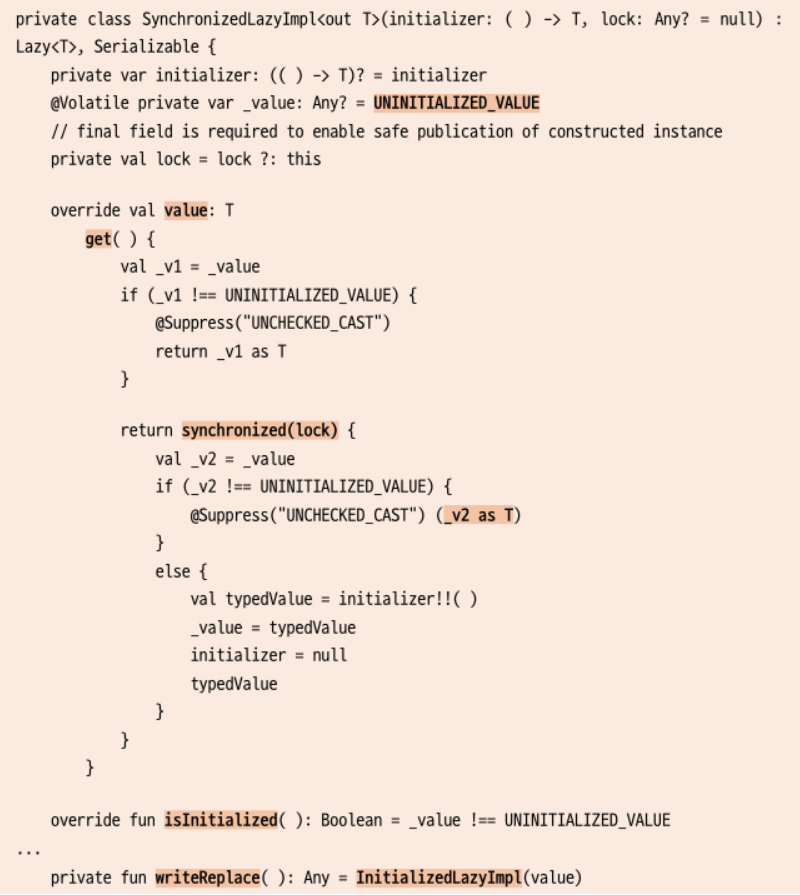

# 6. 프로퍼티와 초기화

### 6-1. 프로퍼티의 접근
    * 프로퍼티 : 클래스 내에 선언한 변수 
    * 자바와 다른 점 : 변수 선언 부분과 기본적인 접근 메서드를 모두 가지고 있음

 

#### 자바에서 필드를 사용할 때의 문제점
* Getter/Setter를 생성해줘야한다.
* 그러나 코틀린에서는 필요없다!!

 

#### 코틀린에서 게터와 세터가 작동하는 방식

~~~kotlin
// 1. 주 생성자에 3개의 매개변수 정의 (내부 선언 버전)
//class User(_id: Int, _name: String, _age: Int) {
//    // 프로퍼티
//    val id: Int = _id // 불변(읽기 전용)
//    var name: String = _name // 변경 가능
//    var age: Int = _age // 변경 가능
//}

// 2. 간소화된 버전
class User(val id: Int, var name: String, var age: Int)

fun main( ) {
    val user = User(1, "Sean", 30)
    val name = user.name // 게터에 의한 값 획득
    user.age = 41 // 세터에 의한 값 지정
    println("name: $name, ${user.age}")
}
~~~

 

#### 기본 게터와 세터 직접 지정하기
    * value: 세터의 매개변수로 외부로부터 값을 가져옴
    * field: 프로퍼티를 참조하는 변수

~~~kotlin
// 직접 구성한 기본 게터/세터
class User_second(_id: Int, _name: String, _age: Int) {
    // 프로퍼티들
    // value, field라는 축약어 등장!!
    val id: Int = _id
        get() = field

    var name: String = _name
        get() = field
        set(value) {
            field = value
        }

    var age: Int = _age
        get() = field
        set(value) {
            field = value
        }
}

fun main() {
    val user1 = User_second(1, "Kildong", 30)
    // user1.id = 2  // val 프로퍼티는 값 변경 불가
    user1.age = 35 // 세터
    println("user1.age = ${user1.age}") // 게터
}
~~~

#### 보조 필드의 역할
    * field는 프로퍼티를 참조하는 변수 (보조 필드 Backing Field) 라고 함
    * get() = field는 결국 각 프로퍼티의 값을 읽는 특별한 식별자
    * get() = age와 같이 사용하면 프로퍼티의 get()을 사용하는 것과 마찬가지 = 무한 재귀 호출에 빠진다.

#### 커스텀 게터와 세터의 사용
    * 사용자가 직접 게터와 세터를 정의하면서 새로운 내용을 작성하는 것
    * 단순히 값을 반환하거나 설정할 때는 굳이 사용할 필요가 없다.
    * 내부 set 앞에 private 를 선언하여 외부에서 접근을 방지할 수도 있다.

~~~kotlin
// 커스텀 게터/세터의 사용
class User_third(_id: Int, _name: String, _age: Int) {
    val id: Int = _id
    var name: String = _name
        set(value) {
            println("The name was changed")
            field = value.toUpperCase() // 받은 인자를 대문자로 변경해 프로퍼티에 할당
        }

    var age: Int = _age
}

fun main() {
    val user1 = User_third(1, "kildong", 35)
    user1.name = "coco"     //the name was changed 호출됨.
    println("user3.name = ${user1.name}")
}
~~~

#### 보조 프로퍼티의 사용
    * 만일 보조 필드를 사용하지 않는 경우에는 암시적으로 사용할 프로퍼티를 선언해 놓고 게터나 세터에 사용할 수 있다.

~~~kotlin
// 커스텀 게터/세터의 사용
class User_fourth(_id: Int, _name: String, _age: Int) {
    val id: Int = _id
    private var tempName: String? = null
    var name: String = _name
        get() {
            if (tempName == null) tempName = "NONAME"
            return tempName ?: throw AssertionError("Asserted by others")
        }
        set(value) {
            println("The name was changed")
            field = value.toUpperCase() // 받은 인자를 대문자로 변경해 프로퍼티에 할당
        }

    var age: Int = _age
}

fun main() {
    val user1 = User_fourth(1, "kildong", 35)
    user1.name = ""
    println("user3.name = ${user1.name}")
}
~~~

#### 프로퍼티의 오버라이딩
    * 프로퍼티는 기본적으로 오버라이딩 할 수 없는 final 형태로 선언
    * open 키워드를 사용하여 오버라이딩이 가능하도록

~~~kotlin
open class First {
    open val x: Int = 0
        get() {
            println("First x")
            return field
        }
    val y: Int = 0 // open 키워드가 없으면 final 프로퍼티임
}

class Second : First() {
    override val x: Int = 0
        get() { // 부모와 구현이 다름
            println("Second x")
            return field + 3
        }
    // override val y: Int = 0 // 에러! 오버라이딩 불가
}

fun main() {
    val second = Second()
    println(second.x) // 오버라이딩된 두번째 클래스 객체의 x
    println(second.y) // 부모로 부터 상속 받은 값
}
~~~

#### 프로퍼티를 이용한 나이 속이기 예제

~~~kotlin
fun main() {
    val kim = FakeAge()
    kim.age = 15
    println("Kim's real age = 15, pretended age = ${kim.age}")

    val hong = FakeAge()
    hong.age = 35
    println("Hong's real age = 35, pretended age = ${hong.age}")
}

class FakeAge {
    var age: Int = 0
        set(value) { // 나이에 따라 판별하는 세터
            field = when {
                value < 18 -> 18
                value in 18..30 -> value
                else -> value - 3
            }
        }
}

~~~

### 6-2. 지연 초기화와 위임
    * 객체의 정보가 나중에 나타나는 경우 객체 생성과 동시에 초기화하기 어려운 경우를 방지하기 위함
    * lateinit / lazy 키워드 사용

#### lateinit을 사용한 지연 초기화
    * 기본 자료형들은 생성자에서 반드시 초기화해야하지만, 츼존성이 있는 초기화나 유닛 테스를 위한 코드를 작성하면서 설정에 의한 초기화를 할 경우에 사용
    * 프로퍼티를 즉시 사용하지 않는데도 미리 생성해서 초기화하는 경우 (메모리 낭비의 경우)

#### lateinit의 제한
    * var로 선언된 프로퍼티만 가능하다
    * 프로퍼티에 대한 게터와 세터를 사용할 수 없다.

~~~kotlin
// lateinit 사용의 예
class Person {
    lateinit var name: String

    fun test() {
        //::은 프로퍼티 참조를 위해 사용
        //! 은 not 의 의미
        if(!::name.isInitialized) { // 프로퍼티의 초기화 여부 판단
            println("not initialized")
        } else {
            println("initialized")
        }
    }
}

fun main() {
    val kildong = Person()
    kildong.test()
    kildong.name = "Kildong" // 이 시점에서 초기화가 된다. (지연초기화)
    kildong.test()
    println("name = ${kildong.name}")
}
~~~

#### 객체 지연 초기화하기
~~~kotlin
data class Person(var name:String, var age:Int)

lateinit var person1: Person

fun main() {
    person1 = Person("Kildong", 30) //생성자 호출 시점에서 초기화됨
}
~~~

#### lazy를 사용한 지연 초기화
    * lateinit은 val을 허용하지 않는다.
    * val 전용으로 lazy를 사용!
    * 특징
      1. 호출 시점에 by lazy(...) 정의에 의해 블록 부분의 최고하를 진행한다.
      2. 불변의 변수 선언인 val에서만 사용 가능하다(읽기 전용)
      3. val이므로 값을 다시 변경할 수 없다.

#### 프로퍼티 지연 초기화하기
    * lazy는 람다식으로 구성되어 lazy인스턴스 반환값을 가지는 함수

~~~kotlin
class LazyTest {
    init {
        println("init block") // (2)
    }

    val subject by lazy {
        println("lazy initialized") // (6)
        "Kotlin Programming" // (7) lazy 반환값
    }
    fun flow() {
        println("not initialized") // (4)
        println("subject one: $subject") // (5) 최초 초기화 시점!
        println("subject two: $subject") // (8) 이미 초기화된 값 사용
    }
}

fun main() {
    val test = LazyTest() // (1)
    test.flow() // (3)
}

//init block 
//not initialized
//lazy initialized
//subject one: Kotlin Programming
//subject two: Kotlin Programming
~~~

#### 객체 지연 초기화하기

~~~kotlin
class Person(val name: String, val age: Int)

fun main() {
    var isPersonInstantiated: Boolean = false

    val person : Person by lazy {           //by lazy 를 사용한 person 객체의 지연 초기화
        isPersonInstantiated = true
        Person("Kim", 23)           // 이 부분이 lazy 객체로 반환됨.
    }
    val personDelegate = lazy { Person("Hong", 40) }

    println("person Init: $isPersonInstantiated")
    println("personDelegate Init: ${personDelegate.isInitialized()}")

    println("person.name = ${person.name}")  // 이 시점에서 초기화
    println("personDelegate.value.name = ${personDelegate.value.name}")  // 이 시점에서 초기화

    println("person Init: $isPersonInstantiated")
    println("personDelegate Init: ${personDelegate.isInitialized()}")
}
~~~

#### lazy 모드 확인하기
    * lazy()는 매개변수 없는 람다식을 받을 수 있으며 Lazy<T>를 반환
    * lazy()의 실행은 구현부 SynchronizedLazyImp()에 보내 처리
    * mode의 경우 Synchronized, Publication, None 으로 지정 가능
      1. SYNCHRONIZED: lock을 사용해 단일 스레드만이 사용하는 것을 보장
      2. PUBLICATION: 여러 군데에서 호출될 수 있으나, 처음 초기화된 후 반환값을 사용한다.
      3. NONE: lock을 사용하지 않기 때문에 빠르지만 다중 스레드가 접근할 수 있다.(값의 일관성을 보장할 수 없음)

#### by를 이용한 위임